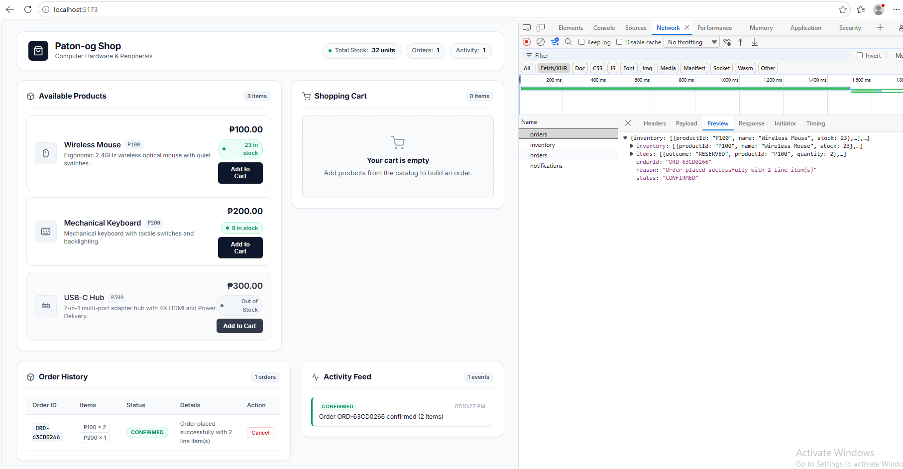
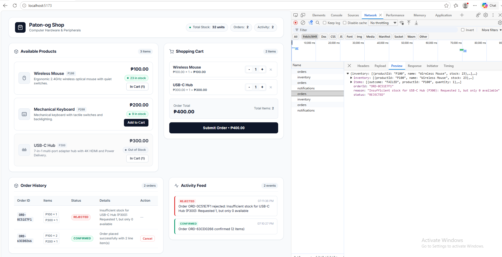
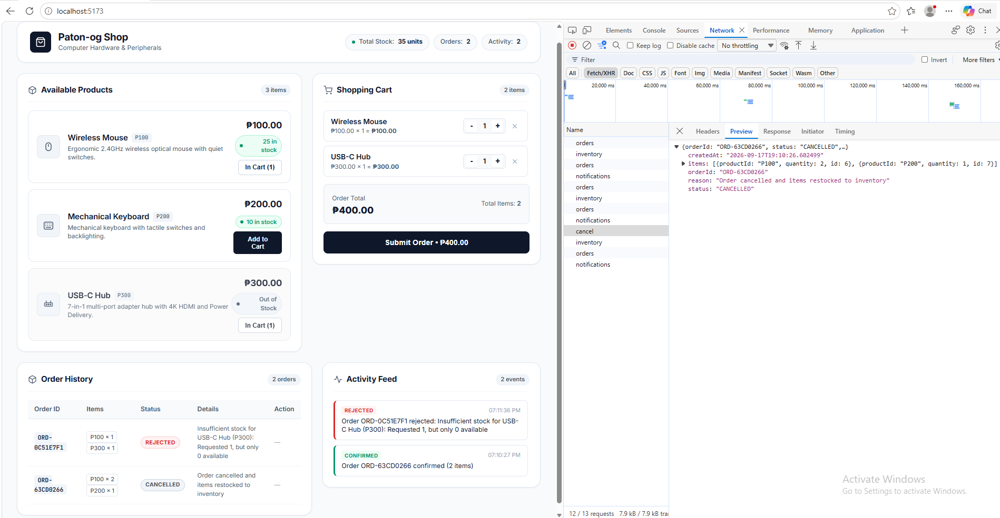
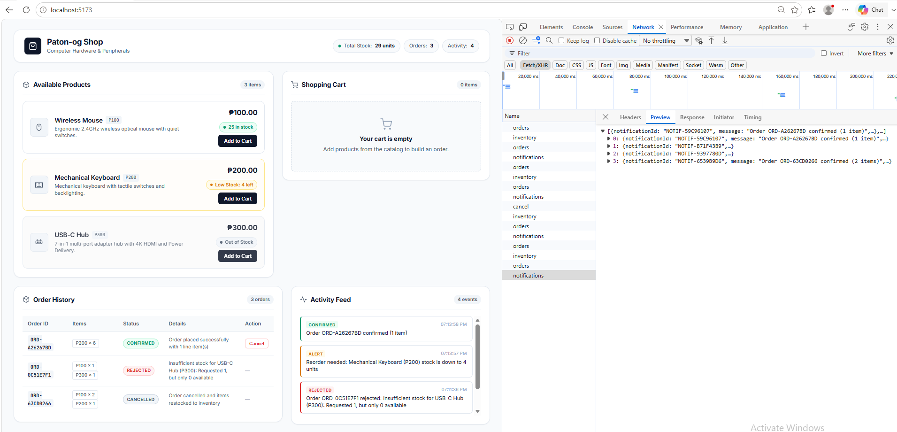

# Modular Monolith Integration — Lab 2: Extending the Modular Monolith

**Course/Lab:** Lab 2: Extending the Modular Monolith  
**Stack:** Java Spring Boot (v4 / Java 17+) + React (Vite) + Supabase (PostgreSQL)  
**Package:** `edu.cit.patonog` (`.shop`, `.inventory`, `.notification`, `.events`)

---

## Overview & Architecture

Lab 2 extends our modular monolith from Lab 1 by introducing:
1. **Multi-Item Orders with Transactional Rollback:** All items are validated before reserving. If any item lacks stock, zero items are reserved (all-or-nothing).
2. **Order Cancellation & Restock:** Reverses module calls by updating status to `CANCELLED` and restocking inventory items via `InventoryService.restock()`.
3. **In-Monolith Domain Events & Notification Module:** `OrderService` and `InventoryService` publish domain events (`OrderPlacedEvent`, `OrderRejectedEvent`, `LowStockEvent`) through Spring's `ApplicationEventPublisher`. The new `Notification` module listens to these events via `@EventListener` with zero direct coupling to the other services.
4. **Low-Stock Auto-Reorder Alerts:** Automatically triggers a `LowStockEvent` whenever an item's stock drops to 5 or below after reservation.
5. **Live Dashboard & Cart:** React frontend featuring a multi-item cart, live inventory dashboard with low-stock badges, order history with cancel buttons, and an event activity feed.

```
+-----------------------------------------------------------------------------------+
|                                  React Frontend                                   |
|                              (http://localhost:5173)                              |
+-----------------------------------------+-----------------------------------------+
                                          |
                                          | HTTP REST (CORS enabled)
                                          v
+-----------------------------------------------------------------------------------+
|                      Spring Boot Monolith (In-Process JVM)                        |
|                                                                                   |
|   +--------------------------+           +------------------------------------+   |
|   |   edu.cit.patonog.shop   | --------> |     edu.cit.patonog.inventory      |   |
|   |      (Order Module)      | In-Process|         (Inventory Module)         |   |
|   |                          |           |                                    |   |
|   |   OrderService           |           |   InventoryService (Public)        |   |
|   |   OrderRepository        |           |   InventoryServiceImpl (Private)   |   |
|   |   OrderController        |           |   InventoryRepository              |   |
|   +------------+-------------+           +-----------------+------------------+   |
|                |                                           |                      |
|                | ApplicationEventPublisher                 | EventPublisher       |
|                v                                           v                      |
|      [OrderPlacedEvent / OrderRejectedEvent]        [LowStockEvent]               |
|                \                                           /                      |
|                 +-------------------+---------------------+                       |
|                                     | In-Process Event Bus                        |
|                                     v                                             |
|                     +-------------------------------+                             |
|                     | edu.cit.patonog.notification  |                             |
|                     |     (Notification Module)     |                             |
|                     |                               |                             |
|                     |  NotificationEventListener    |                             |
|                     |  NotificationRepository       |                             |
|                     |  NotificationController       |                             |
|                     +---------------+---------------+                             |
+-------------------------------------|---------------------------------------------+
                                      | Spring Data JPA (Shared Supabase Database)
                                      v
           +------------------------------------------------------+
           |                 Supabase PostgreSQL                  |
           |   inventory | orders | order_items | notifications   |
           +------------------------------------------------------+
```

---

## Project Structure

```
monolith/
├── src/
│   ├── main/
│   │   ├── java/edu/cit/patonog/
│   │   │   ├── ShopApplication.java            # @SpringBootApplication entry point
│   │   │   ├── config/
│   │   │   │   └── WebCorsConfig.java          # CORS config enabling frontend access
│   │   │   ├── events/                         # In-Monolith Domain Events
│   │   │   │   ├── OrderPlacedEvent.java       # Published when order is CONFIRMED
│   │   │   │   ├── OrderRejectedEvent.java     # Published when order is REJECTED
│   │   │   │   └── LowStockEvent.java          # Published when stock <= 5
│   │   │   ├── inventory/                      # Inventory Module
│   │   │   │   ├── InventoryItem.java          # JPA entity for 'inventory' table
│   │   │   │   ├── InventoryRepository.java    # Spring Data JPA Repository
│   │   │   │   ├── InventoryService.java       # Public interface (getItem, reserve, restock)
│   │   │   │   └── InventoryServiceImpl.java   # PACKAGE-PRIVATE service implementation
│   │   │   ├── shop/                           # Order / Shop Module
│   │   │   │   ├── Order.java                  # JPA entity for 'orders' table
│   │   │   │   ├── OrderItem.java              # JPA entity for 'order_items' table
│   │   │   │   ├── OrderItemDto.java           # DTO for line item requests and outcomes
│   │   │   │   ├── OrderRepository.java        # Spring Data JPA Repository
│   │   │   │   ├── OrderRequest.java           # Multi-item request DTO ({ items: [...] })
│   │   │   │   ├── OrderResponse.java          # Response DTO ({ orderId, status, items, inventory })
│   │   │   │   ├── OrderService.java           # Multi-item validation, rollback & cancellation
│   │   │   │   └── OrderController.java        # REST endpoints (/api/orders, /api/orders/{id}/cancel)
│   │   │   └── notification/                   # Decoupled Notification Module
│   │   │       ├── Notification.java           # JPA entity for 'notifications' table
│   │   │       ├── NotificationRepository.java # JPA Repository for notifications
│   │   │       ├── NotificationEventListener.java # @EventListener for domain events
│   │   │       └── NotificationController.java # REST endpoint (GET /api/notifications)
│   │   └── resources/
│   │       └── application.properties          # Environment variable-based configuration
│   └── test/
│       └── java/edu/cit/patonog/
│           └── ShopApplicationTests.java       # Unit tests for multi-item orders, cancel & events
├── frontend/                                   # React (Vite) Frontend
│   ├── src/
│   │   ├── App.jsx                             # Cart, live inventory, cancel action, activity feed
│   │   ├── index.css                           # Compact styling for 100% zoom
│   │   └── main.jsx                            # React root
│   ├── package.json
│   └── vite.config.js
├── supabase_schema.sql                         # Complete Lab 2 SQL schema & seed script
├── .env.example                                # Environment variable template
├── .gitignore                                  # Excludes credentials and build artifacts
├── pom.xml                                     # Maven dependencies
└── README.md
```

---

## Supabase Setup Guide

### 1. Database Schema Execution
Open the **SQL Editor** in your Supabase dashboard and run the entire script [`supabase_schema.sql`](supabase_schema.sql):

```sql
-- 1. Create Inventory Table
CREATE TABLE IF NOT EXISTS inventory (
    product_id VARCHAR(50) PRIMARY KEY,
    name VARCHAR(255) NOT NULL,
    stock INT NOT NULL CHECK (stock >= 0)
);

-- 2. Seed Initial Inventory Data
INSERT INTO inventory (product_id, name, stock) VALUES
    ('P100', 'Wireless Mouse', 25),
    ('P200', 'Mechanical Keyboard', 10),
    ('P300', 'USB-C Hub', 0)
ON CONFLICT (product_id) DO UPDATE 
SET name = EXCLUDED.name, stock = EXCLUDED.stock;

-- 3. Create Orders Table
CREATE TABLE IF NOT EXISTS orders (
    order_id VARCHAR(100) PRIMARY KEY,
    status VARCHAR(50) NOT NULL,
    reason VARCHAR(255),
    created_at TIMESTAMP WITH TIME ZONE DEFAULT CURRENT_TIMESTAMP
);

-- 4. Create Order Items Table (Multi-Item Support)
CREATE TABLE IF NOT EXISTS order_items (
    id BIGSERIAL PRIMARY KEY,
    order_id VARCHAR(100) NOT NULL REFERENCES orders(order_id) ON DELETE CASCADE,
    product_id VARCHAR(50) NOT NULL REFERENCES inventory(product_id),
    quantity INT NOT NULL CHECK (quantity > 0)
);

-- 5. Create Notifications Table (Domain Event Log)
CREATE TABLE IF NOT EXISTS notifications (
    notification_id VARCHAR(100) PRIMARY KEY,
    message VARCHAR(500) NOT NULL,
    created_at TIMESTAMP WITH TIME ZONE DEFAULT CURRENT_TIMESTAMP
);
```

---

## Environment Variables Setup

Configure your Supabase database credentials in PowerShell before launching:

```powershell
$env:SPRING_DATASOURCE_URL="jdbc:postgresql://aws-0-ap-northeast-2.pooler.supabase.com:6543/postgres?sslmode=require"
$env:SPRING_DATASOURCE_USERNAME="postgres.iqknbaihemnsfllbrmfh"
$env:SPRING_DATASOURCE_PASSWORD="<your-database-password>"
```

---

## Running the Application

### 1. Spring Boot Backend
```powershell
# Run automated tests
.\mvnw test

# Start the server on port 8080
.\mvnw spring-boot:run
```

### 2. React Frontend
```powershell
cd frontend
npm install
npm run dev
```
Open `http://localhost:5173` in your browser.

---

## Synchronous vs. Asynchronous Event Listeners (`@Async`)

In our implementation, the `NotificationEventListener` runs **synchronously** (Spring's default `@EventListener`).

### Why Synchronous was Chosen:
1. **Predictability & Simplicity:** Synchronous execution keeps the event handling on the same execution thread as the HTTP request. When an order is placed or rejected, the notification record is persisted immediately before the HTTP response is returned to the client, guaranteeing that the frontend's subsequent `GET /api/notifications` call will reliably find the new event.
2. **Transactional Integrity:** Both the order creation and notification insert participate within the request scope, eliminating race conditions.

### What Changes if `@Async` is Used:
If `@Async` were added to `@EventListener`:
- **Decoupled Latency:** The HTTP response wouldn't wait for notifications to be saved, which would be useful if the notification module sent emails, SMS, or external webhooks.
- **Requirements to Add:** We would need `@EnableAsync` in Spring Boot, an asynchronous thread pool task executor (`ThreadPoolTaskExecutor`), and `@TransactionalEventListener(phase = TransactionPhase.AFTER_COMMIT)` to ensure events are only handled after the database transaction has safely committed. If the listener failed, error handling would need dedicated dead-letter or compensation logic since it wouldn't propagate back to the caller.

---

## Network Tab Evidence

### Scenario 1: Multi-Item Order All Succeed (`CONFIRMED`)
- **Action:** Add `P100` (qty 2) and `P200` (qty 1) to cart, click Submit Order.
- **Request:** `POST /api/orders` with `{ "items": [{ "productId": "P100", "quantity": 2 }, { "productId": "P200", "quantity": 1 }] }`
- **Response:** HTTP 200 with `"status": "CONFIRMED"`, both line items marked `"outcome": "RESERVED"`.



### Scenario 2: Multi-Item Order One Item Fails (`REJECTED` with All-or-Nothing Rollback)
- **Action:** Add `P100` (qty 1) and `P300` (qty 1, 0 stock) to cart, click Submit Order.
- **Request:** `POST /api/orders` with `{ "items": [{ "productId": "P100", "quantity": 1 }, { "productId": "P300", "quantity": 1 }] }`
- **Response:** HTTP 200 with `"status": "REJECTED"`, `"reason": "Insufficient stock for USB-C Hub (P300)..."`. P100 stock is completely untouched (0 units reserved).



### Scenario 3: Order Cancellation with Restock
- **Action:** Click "Cancel Order" on a confirmed order in the order history.
- **Request:** `POST /api/orders/{orderId}/cancel`
- **Response:** HTTP 200 with `"status": "CANCELLED"`. Immediately followed by `GET /api/inventory` showing stock restored to its previous count.



### Scenario 4: Notification Feed Showing Confirmed, Rejected, and Low-Stock Alert
- **Action:** View the activity feed after placing orders.
- **Request:** `GET /api/notifications`
- **Response:** HTTP 200 returning list containing order confirmation entries, order rejection entries, and `"Reorder needed: ... stock is down to X units"` entries.



---

## Reflection

### 1. Multi-Item Orders & Transactional Atomicity (In-Process vs. Network)

In our modular monolith, handling multi-item orders was simpler than I expected because everything runs inside one JVM. The way we implemented it is with a two-pass approach. The first pass goes through all the requested items and checks if each product has enough stock. If even one item fails, the whole order gets rejected right away and nothing gets reserved. Only when all items pass does the second pass actually call `InventoryService.reserve()` for each one. Since both the `shop` and `inventory` modules share the same database connection and run under Spring's `@Transactional`, any unexpected failure during reservation will automatically roll back the entire operation. This makes it impossible for a partial order to ever end up saved in the database.

If we were to split `Order` and `Inventory` into separate microservices, we would completely lose the ability to do this with a single transaction. Each `reserve()` call would be a separate HTTP request hitting a different database. To deal with that, we would need to use the Saga Pattern. For example, in an orchestration-based saga, a coordinator service would send reserve requests one by one. If the second item fails after the first one already succeeded, the coordinator would need to send a compensating request to undo the first reservation and put the stock back. It adds a lot of complexity compared to what we have now.

---

### 2. Event-Driven Decoupling: In-Process vs. Microservices

One of the things I found really interesting in this lab was how publishing domain events through Spring's `ApplicationEventPublisher` completely removes the need for `OrderService` to know anything about the `Notification` module. In the code, `OrderService` only imports the event classes like `OrderPlacedEvent` and `OrderRejectedEvent`. It has no idea that a `NotificationEventListener` even exists. On the other side, the `Notification` module only depends on those same event classes and never calls `OrderService` or `InventoryService` directly. This means if we wanted to change how notifications work, or even turn them off entirely, we would not need to touch any order processing code.

If the `Notification` module were extracted into a separate microservice, the in-process event bus would stop working because the two services would be running in completely different processes. We would have to bring in an external message broker like RabbitMQ or Apache Kafka. The `OrderService` would publish events as JSON messages to a topic, and the Notification service would consume from that topic and save the records to its own database. We would also need to think about things like the Transactional Outbox Pattern to make sure events do not get lost if the broker is temporarily unavailable, and idempotent consumers on the notification side to avoid saving duplicate notifications if a message gets delivered more than once.

---

### 3. Microservice Extraction Decision

If I had to pick one module to extract into its own microservice first, I would go with the **Notification** module. The main reason is that it is already the most decoupled part of the system. It does not call any other service, it only listens for events and writes to its own table, and nothing in the application ever waits for a response from it. Extracting it would not break any existing business logic.

Extracting the `Inventory` module first would be a much riskier move. The `Order` and `Inventory` modules have a tight dependency because reserving stock needs to happen inside the same transaction as creating an order. Pulling them apart would immediately require implementing a distributed saga with compensating transactions, which is significantly harder to get right.

To actually extract the `Notification` module, the steps would be fairly straightforward. We would move `Notification`, `NotificationRepository`, `NotificationEventListener`, and `NotificationController` into a brand new Spring Boot project with its own database. In the monolith, instead of publishing in-process events, we would send messages to a broker like RabbitMQ or Kafka. The new Notification service would then subscribe to those messages, persist them, and expose the `GET /api/notifications` endpoint on its own.

